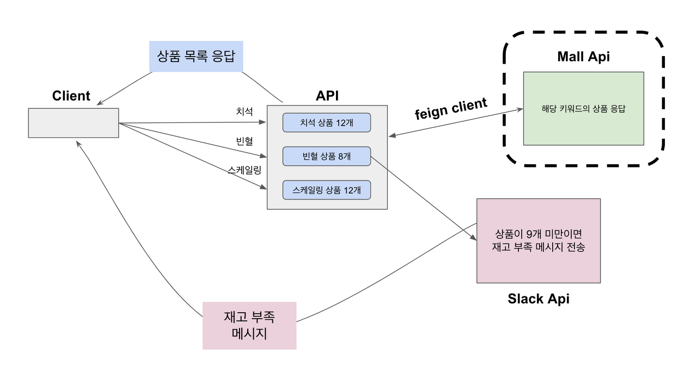
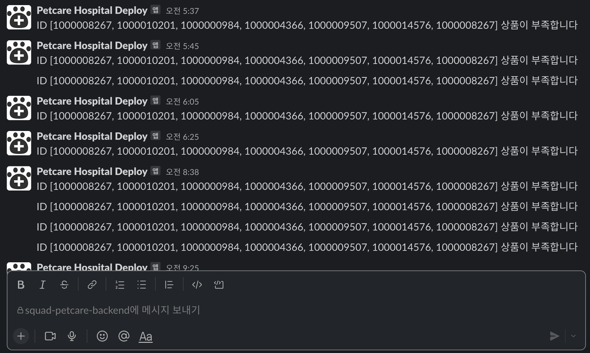
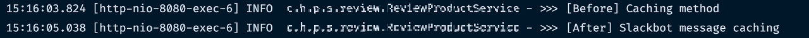
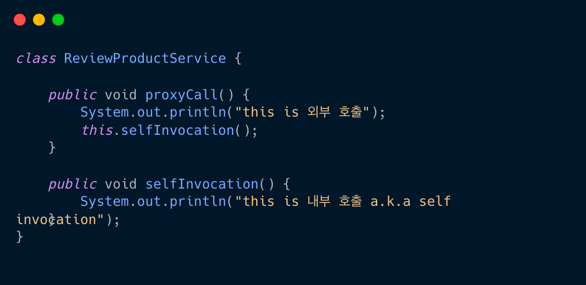
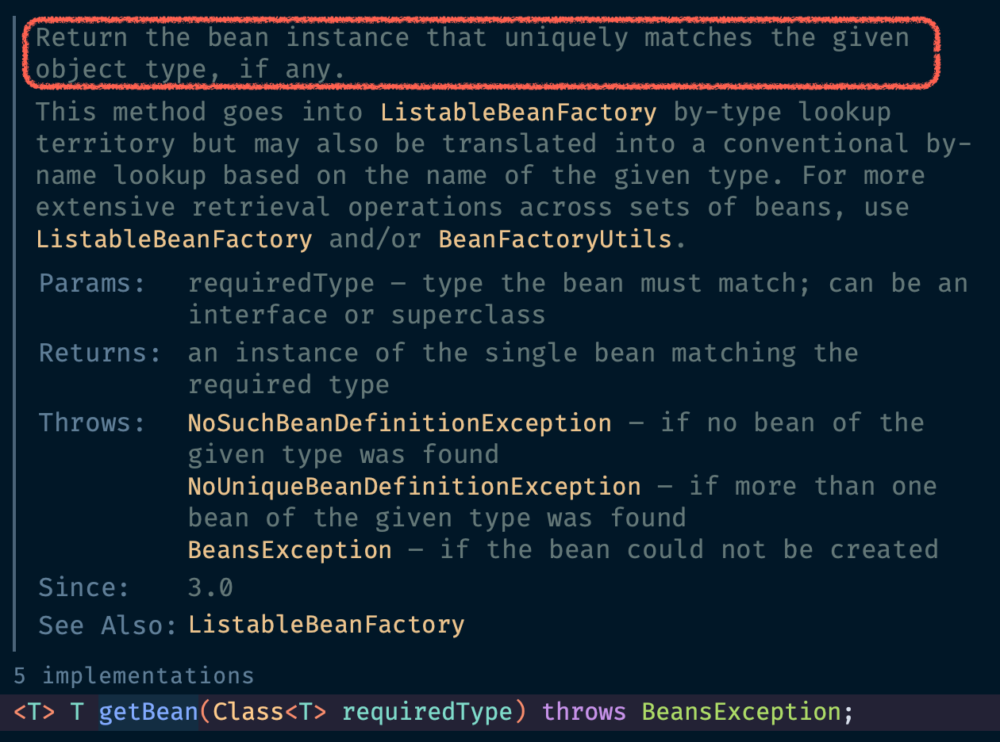
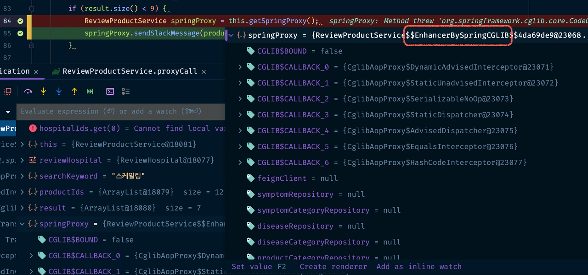
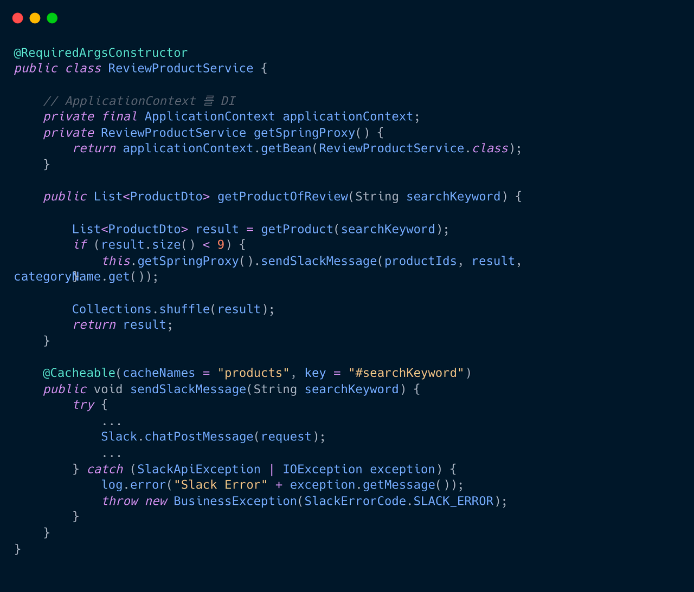
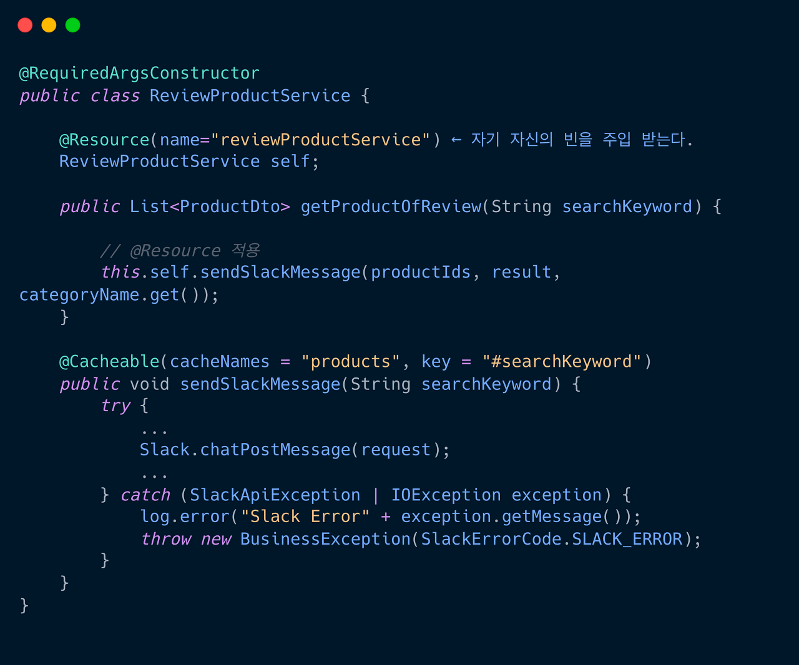

### 목차
- 배경
- 문제
- API 개선 요구사항
- 현재 API 사항

- 개선된 API 요구사항
  - 첫 번째 시도
  - 두 번째 시도
  - 세 번째 시도

- Self-Invocation 해결 방안 (Proxy 생성)
  1) ApplicationContext DI
  2) @Resource으로 AutoWiring

- 마무리

<br>

### 배경

1. 클라이언트에서 특정 키워드로 조회하면, 해당 키워드에 해당하는 상품 목록을 받아온다.
   1. 쇼핑몰 API 에서 상품을 보내주며, 12개의 상품을 디폴트로 보내준다.
   2. 쇼핑몰 API에서 해당 키워드의 상품 재고가 부족하면, 12개 미만으로 응답할 수 있다.

2. 상품의 개수가 9개 미만이면, 재고 보충 notify 를 위해 슬랙봇 메시지가 전송된다.


<br>
<br>

### 문제
상품 재고가 부족한 키워드로 api 요청이 계속 들어오면 어떻게 될까요?

매번 api 요청마다 슬랙봇이 전송되기 때문에 굉장히 귀찮은 상황이 벌어집니다. 아래처럼요.
 머..멈춰..


때문에 동일한 키워드로 요청이 들어오더라도 최초 한 번만 슬랙봇 메시지를 전송하고, 그 후부터는 메시지가 전송되지 않도록 조치가 필요했습니다.

<br>
<br>

### API 개선 요구사항
- 특정 키워드의 상품 목록을 가져온다.
- 상품 목록의 순서는 매 요청마다 랜덤으로 달라진다. (Shuffle 처리)
- 상품 재고가 9개 미만으로 떨어지면, 재고 보충을 위해 슬랙봇 메시지를 전송한다.
- 슬랙봇 메시지는 동일한 키워드에 대해 최초 1회만 전송되야 한다.

<br>


### 현재 API 사항
- 특정 키워드의 상품 목록을 가져온다.
- 상품 목록의 순서는 매 요청마다 랜덤으로 달라진다. (Shuffle 처리)
- 상품 재고가 9개 미만으로 떨어지면, 재고 보충을 위해 슬랙봇 메시지를 전송한다.
- 상품 재고가 9개 미만인 키워드의 매 요청마다 슬랙봇 메시지가 전송된다. ⬅️ 개선하고 싶은 사항

<br>


### 개선된 API 요구사항
- 슬랙봇 메시지는, 동일한 키워드에 대해 최초 1회만 전송돼야 한다.

슬랙봇 메시지를 1번만 전송하기 위해 캐시를 적용하기로 했고, 경량 캐시인 Ehcache를 사용하기로 했습니다.

<br>

### 첫 시도

시행착오 과정을 위해 처음 짠 코드부터 보여드리겠습니다.
("뭐야, 해결책이나 보여줘요" 하시는 분들은 세번째 시도 목차로 가시면 됩니다 뀨)

``` java
@Cacheable(cacheNames = "products", key = "#searchKeyword")
public List<ProductDto> getProductOfReview(String searchKeyword) {

    List<ProductDto> result = getProduct(searchKeyword); // <- mall api 에서 상품 정보 조회
    if (result.size() < 9) {
        sendSlackMessage(); // <- slackbot 전송 메서드
    }

    Collections.shuffle(result); // <- shuffle 처리
    return result;
}


// slackbot 전송 메서드
public void sendSlackMessage() {

    try {
        ...
        Slack.chatPostMessage(request);
        ...
    } catch (SlackApiException | IOException exception) {
        log.error("Slack Error" + exception.getMessage());
        throw new BusinessException(SlackErrorCode.SLACK_ERROR);
    }
}
```

<br>

상품을 조회하는 메서드 자체에 캐시를 걸었습니다.

동일한 searchKeyword의 캐시 처리는 잘 되지만 2가지 문제가 있습니다.

1) 상품이 shuffle 되지 않음 -> 상품이 무작위로 떨어지지 않고, 동일한 순서로 조회된다. (기획 정책과 다름)

2) 한번 캐싱되면, 상품이 9개 미만으로 떨어지더라도, 슬랫봇이 울리지 않는다. (재고가 부족해지더라도 노티 할 수 없음)

3) 슬랙봇이 최초 1회조차 전송되지 않을 수 있다.


위의 문제를 해결하기 위해 두 번째 시도로 갑니다.

<br>

### 두번째 시도
1. 슬랙봇 전송 메서드 sendSlackMessage() 만 캐시처리
- 슬랙봇 전송 메서드만 캐싱됨

- 최초 한 번만 슬랙봇이 동작하고, 그 이후론 메시지가 전송되지 않는다.


이렇게 되면 첫 번째 시도의 문제점을 해결할 수 있습니다.

1. 상품이 정상적으로 shuffle 된다.

2. 상품이 9개 미만으로 떨어지면, 슬랙봇 전송 메서드가 호출된다.

``` java
public List<ProductDto> getProductOfReview(String searchKeyword) {

    List<ProductDto> result = getProduct(searchKeyword);
    if (result.size() < 9) {
        log.info(">>> [Before] Caching method");
        // slackbot 전송 메서드
        sendSlackMessage(searchKeyword);
    }

    Collections.shuffle(result);
    return result;
}


// slackbot 전송 메서드 캐시 적용
@Cacheable(cacheNames = "products", key = "#searchKeyword")
public void sendSlackMessage(String searchKeyword) {
    log.info(">>> [After] Slackbot message caching");
    try {
        ...
        Slack.chatPostMessage(request);
        ...
    } catch (SlackApiException | IOException exception) {
        log.error("Slack Error : {}", exception.getMessage());
        throw new BusinessException(SlackErrorCode.SLACK_ERROR);
    }
}
```
이제 문제점을 모두 해결했으니 코드를 실행하여, 캐싱이 잘 되는지 확인해 보겠습니다.


<br>

동일한 키워드로 API 요청을 2번 보냈을 때 로그 결과입니다.




<br>

캐시가 제대로 동작했다면 최초 한 번만 `>>> [After] Slackbot message caching` 로그가 출력 돼야 하지만, 두 번째 호출에도 로그가 출력된 것을 볼 수 있습니다. 왜 캐시가 동작하지 않을까요?
이 문제를 해결하기 위해선 `Spring AOP의 self invocation` 에 대해 알아야 합니다.

<br>


### 세 번째 시도
세 번째 시도 전에 self invocation 이 무엇인지 간단히 알아보겠습니다.

**Self invocation 이란?**

컨트롤러 단에서 proxyCall() 이란 메서드를 호출한다고 가정합니다. 그리고 그 내부에서 selfInvocation() 메서드를 호출하는 것을 볼 수 있습니다. 즉 동일한 객체 내에서 자신 외의 메서드를 호출하는 것을 self-invocation이라 부르는데, Proxy에서는 이러한 self-invocation에서 문제가 발생합니다.



<br>

### Spring AOP

Spring AOP는 @Cacheable 이 적용된 메서드를 캐싱하기 위해 인터셉터를 통해 외부의 요청을 가로챕니다.
Proxy를 통해 들어오는 메서드 호출만 인터셉트하기 때문에, 동일 클래스 내부(this)에서 접근된 경우는 캐시가 동작하지 않습니다.

정리하자면 Spring AOP는@Cacheable의 동작을 위해 외부의 요청을 인터셉트하여 캐싱하지만,
내부 호출은 proxy 가 아닌 실제 객체가 호출하는 것이기 때문에 Spring AOP 가 캐싱할 수 없습니다.
그렇기 때문에 첫 번째 시도에서는 캐시가 정상적으로 동작했죠. getProductOfReview() 메서드는 컨트롤러에서 (외부) 호출하기 때문입니다.

하지만 두 번째 시도에선 캐시가 동작하지 않았는데,
sendSlackMessage() 메서드가 외부에서 호출되지 않고 getProductOfReview() 메서드 내부에서 호출됐기 때문입니다. 즉 Self-invocation 됐습니다.


self-invocation 에선 왜 @Cacheable 이 동작하지 않을까요? Spring AOP는 캐싱을 위해 proxy 객체를 참조 후 메서드를 호출해야 하지만, self-invocation 메서드는 proxy 객체가 아닌 실제 객체(this)를 호출하기 때문입니다.

<br>

### Self-Invocation 해결 방안 (Proxy 생성)

내부 호출 시에도 this 가 아닌 proxy를 참조할 수 있다면, proxy에 캐싱된 데이터를 받아 올 수 있습니다.

즉 @Cacheable sendSlackMessage() 메서드를 self-invocation 이 아닌 proxy 객체로 호출하는 것입니다.

2가지 방법으로 접근할 수 있는데,

1) ApplicationContext에서 동일한 클래스의 proxy bean을 생성하여 사용하거나

2) @Resource 어노테이션으로 self-autowiring 할 수 있습니다.


<br>

### 1) ApplicationContext DI

getSpringProxy() 메서드 내부에서 applicationContext.getBean(ReviewProductService.class)를 선언합니다.

이렇게 하면 getBean()의 인자와 동일한 타입의 Bean 인스턴스가 반환됩니다. 즉 getBean() 의 인자가 ReviewProductService 타입의 프록시 객체라면, 동일하게 ReviewProductService 타입의 프록시가 리턴되는 거죠.

프록시 객체가 sendSlackMessage()를 호출하게 됨으로, @Cacheable 이 적용된 sendSlackMessage()는 정상적으로 캐시 처리 됩니다.

getBean() 의 정의


<br>

getSpringProxy() 의 리턴타입은 CGLIB 프록시인 것을 디버그로 확인


<br>



프록시 객체가 sendSlackMessage() 를 호출하게 됨으로, @Cacheable 이 적용된 sendSlackMessage() 는 정상적으로 캐시 처리 됩니다.

<br>

### 2) @Resource으로 AutoWiring

스프링 4.3부턴 @Resource 어노테이션으로 self autowiring을 사용할 수 있습니다. 1)의 방법처럼 ApplicationContext를 통해 Bean을 가져올 필요없이 간단히 자신의 Bean 을 주입받을 수 있습니다.



이렇게 하여 API의 요구사항을 만족하는 동시에 슬랙봇은 한 번만 전송되도록 API를 수정할 수 있었습니다.


### 마무리

무심코 사용한 @Cacheable 어노테이션에도 수많은 원리와 이유가 있음을 배웠습니다. 간단한 캐시 적용이라 생각했지만, 그 속에서 Self Invocation과 Spring AOP, Proxy라는 다소 복잡한 개념을 알 수 있었습니다.
