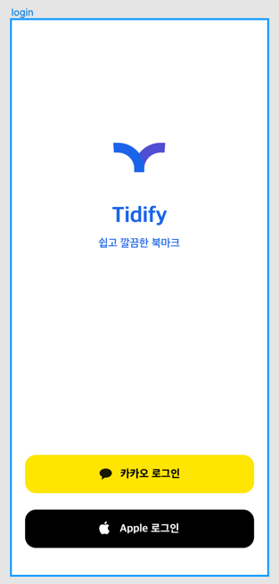
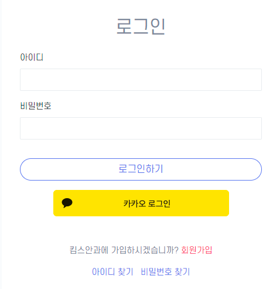

### OAuth 등장배경 (Open Authorization)

기존 초기 트위터, 써드 파티 앱이 트위터 비밀번호를 그대로 전달받아 트위터에 로그인.
써드 파티 앱이 트위터 비밀번호를 그대로(plain text) 저장하기도 함.
이런 초기 문제 해결하기 위해 OAuth1.0 과 유사한 기능 구현. 유사 Oauth
Google의 AuthSub, Yahoo BBAuth etc..
다양한 해결책이 나왔지만 상호간 완전한 호환되지 않는 문제 존재.

2007년 경, 트위터 치프 아키텍트 Blaine Cook 형이 이런말을 함
> We want something like Flickr Auth / Google AuthSub / Yahoo! BBAuth,
> but published as an open standard, with common server and client libraries, etc.

여러 전문가가 모여 Oauth1.0 스펙을 출시, 2009년 11월 Oauth1.1 을 drop 하고 이전과 완전 다른 2.0 버전에 집중하기로 합
모바일 환경에서도 적용가능하도록 업데이트,기존 1버전의 혼란스런 면을 단순화

### OAuth 란?

외부서비스의 인증 및 권한 부여를 관리하는 범용 Framework
리소스 소유자를 대신해 구글, 페이스북 같은 다양한 플랫폼의 특정 사용자 데이터에 접근하여 사용자의 접근 권한을 받을 수 있는 표준 프로토콜

### Oauth2.0 용어

- Resource Owner
  - 리소스 소유자. 즉 써드파티 어플리케이션을 사용하면서 카카오, 구글 등의 플랫폼에 개인 정보를 저장해둔 사용자를 의미.
  - 이때 개인 정보는 비단, 사용자의 이름 생년월일, 이메일 뿐만 아니라 카카오톡 친구 목록, 구글 캘린더 정보 등이 해당
- Authorization Server
  - Resource Owner 를 인증하여 Client에게 액세스 토큰을 발급하는 서버
  - Access Token, Refresh Token 등을 발급
- Resource Server
  - Oauth2.0 을 관리하는 서버(구글, 카카오)의 자원을 관리하는 서버. 우리가 만드는 써드파티 서버 아님.
- Client
  - Resource Server 의 자원을 이용하고자 하는 서비스(우리의 애플리케이션)
  - Client 와 Resource Owner 를 헷갈리지 않는 것이 중요

### Oauth2.0 Mechanism

1. Resource Owner 가 Client 에게 인증 요청 보냄
   client 는 authorization server 에 로그인 요청
   

2. Login Page 제공 from Authorization Server
   

3. Resource Owner의 ID/PW 제공
   이 정보는 Client 에게 가는 것이 아닌 Authorization Server 로 전송됨

4. Authorization Server 는 Authorization Code 발급
5. 사용자는 Authorization Code 와 함께 Client 의 Redirect Uri 로 리다이렉트 됨

- 이때 Redirect Uri를 어떤 페이지라 생각하지 말고, API Controller 로 생각하자.

6. Client ->  Authorization Code, Client Id, Client Secret (Optional) => Authorization Server
7. `Access Token` 발급 -> DB 에 저장
8. 로그인 성공
9. 사용자의 서비스 요청 -> Access Token 으로 `Resouce Server` 호출
10. Access Token 검증 후 리소스 제공

### Authorization Code 가 굳이 필요한 이유
Authorization Code 를 전달하는 방법은 url 의 쿼리 파라미터.
Access Token 을 여기에 담는다? 바로바로 탈취각
