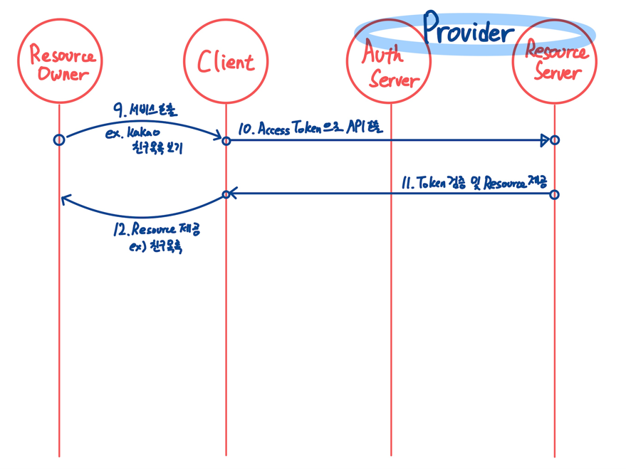

# OAuth 등장배경 (Open Authorization)

초기 트위터 시절, 써드 파티 앱을 사용해 트위터에 글을 올리는 기능이 있었다.
지금으로선 상상도 하기 힘든 일이지만 당시에는 트위터의 비밀번호를 써드 파티 앱이 그대로 전달받아 트위터 로그인을 진행했다.
트위터 계정의 비밀번호를 써드 파티 앱이 그대로(plain text) 저장하는 등 보안상 허점이 굉장히 많았다.

이런 초기 문제 해결하기 위해 Google의 AuthSub, Yahoo BBAuth 등 다양한 회사에서 유사한 기능을 구현했지만
표준화 되어 있지 않고, 상호간 호환되지 않는 문제점이 존재했다.

2007년 당시 트위터 치프 아키텍트 Blaine Cook 형은 이런말을 했다.
> We want something like Flickr Auth / Google AuthSub / Yahoo! BBAuth,
> but published as an open standard, with common server and client libraries, etc.

여러 전문가가 모여 Oauth1.0 스펙을 정의했지만, 2009년 11월 Oauth1.1 을 drop 하고 이전과 완전 다른 2.0 버전에 집중하기로 한다.
OAuth2.0은 모바일 환경에서도 적용 가능하도록 업데이트하고 기존 1 버전의 혼란스러운 면을 단순화하는 것을 목표로 했다.

# OAuth 란?

외부서비스의 인증 및 권한 부여를 관리하는 범용 Framework.
리소스 소유자를 대신해 `구글, 페이스북` 같은 플랫폼의 사용자 데이터에 접근하여 사용자의 접근 권한을 가져올 수 있는 `표준` 프로토콜

# Oauth2.0 용어

### Resource Owner

- 리소스 소유자.
- 즉 써드파티 어플리케이션을 사용하면서 카카오, 구글 등의 플랫폼에 개인 정보를 저장해둔 사용자를 의미.
- 이때 개인 정보는 사용자의 이름 생년월일, 이메일 뿐만 아니라 카카오톡 친구 목록, 구글 캘린더 정보 등이 해당

### Client

- Resource Server 의 자원을 이용하고자 하는 서비스(우리의 애플리케이션)
- Client 와 Resource Owner 를 헷갈리지 않는 것이 중요

### Authorization Server

- Resource Owner 를 인증하여 Client에게 액세스 토큰을 발급하는 서버
- Access Token, Refresh Token 등을 발급

### Resource Server

- Oauth2.0 을 관리하는 서버(구글, 카카오)의 자원을 관리하는 서버. 우리가 만드는 써드파티 서버 아님.

# OAuth2.0 사용절차

OAuth2.0 을 사용하기 위해선 Client 를 Resource Server 에 우선 등록해야 한다.
이 때 `Redirect URI`를 등록하는데, 사용자 인증을 마친 후 (ex, Kakao login) 사용자를 리디렉션 시킬 위치를 의미한다.

### Redirect URI

- OAuth2.0 서비스 인증을 마친 사용자는 사전에 등록된 Redirect URI 로 리디렉션 된다.
- 이 Redirect URI 는 Front-end uri 가 될 수도 있고, Back-end API end point 가 될 수도 있다. (즉 개발자가 정하는 것)
- Redirect URI는 서비스에 따라 여러개 등록할 수도 있다.

### Client ID, Client Secret

- 등록 과정을 마치면 Client ID, Secret 을 얻을 수 있다. (Secret 은 Optional 일 수 있다.)
- 이 둘은 Access Token 을 획득하는데 사용된다.

 

# Oauth2.0 Mechanism

1. Resource Owner 가 Client 에게 인증 요청 보냄
   client 는 authorization server 에 로그인 요청

[//]: # (   ![img.png]&#40;img.png&#41;)

2. Login Page 제공 from Authorization Server

[//]: # (   ![img_1.png]&#40;img_1.png&#41;)

3. Resource Owner의 ID/PW 제공
   이 정보는 Client 에게 가는 것이 아닌 Authorization Server 로 전송됨

4. Authorization Server 는 Authorization Code 발급
5. 사용자는 Authorization Code 와 함께 Client 의 Redirect Uri 로 리다이렉트 됨

- 이때 Redirect Uri를 어떤 페이지라 생각하지 말고, API Controller 로 생각하자.

6. Client ->  Authorization Code, Client Id, Client Secret (Optional) => Authorization Server

7. `Access Token` 발급 -> DB 에 저장

8. 로그인 성공

9. 사용자의 서비스 요청
10. Access Token 으로 `Resouce Server` 호출

11. Access Token 검증 후 리소스 제공
12. Client 는 Resource Server 로 부터 전달받은 Resource 제공

# Authorization Code 가 필요한 이유

Access Token 과 Authorization Code 가 헷갈릴 수 있다.
Access token 과 Auth Code 모두 Auth server 에서 발급되는데 왜 굳이 두 과정을 나누어 발급하는 것일까?

Access Token 은 문자 그대로 (Resource 에) Access 하기 위한 토큰으로, 탈취되면 개인정보도 함께 탈취될 수 가능성이 있다.
즉 Access Token은 보안 상 이유로 클라이언트에게 전달하지 않고, Client(서버) 가 보관하며 필요시에만 Resource Server 에 전송하여 Resource 를 요청한다.

Authorization Code 는 Auth Server 를 통해 url 의 쿼리 파라미터로 전달된다. (Client Server 를 거치지 않고 곧바로 사용자에게 전달)
쿼리 파라미터에 담긴 정보는 비교적 노출이 쉽기 때문에 Access Token 처럼 민감한 정보를 담을 시 바로바로 탈취될 위험이 있다.

즉 Authorization Code 는 Access Token 을 발급받기 위한 단계적 보안으로 생각할 수 있다.

# OAuth2.0 의 장단점

**장점**

1. 손쉬운 회원가입 및 로그인
2. 사용자 정보에 무작위적으로 접근하지 않고 안전하게 접근할 수 있다.

**단점**

1. 사용자 정보에 제한적 접근
2. 중복 가입 방지를 위한 추가 로직 필요
