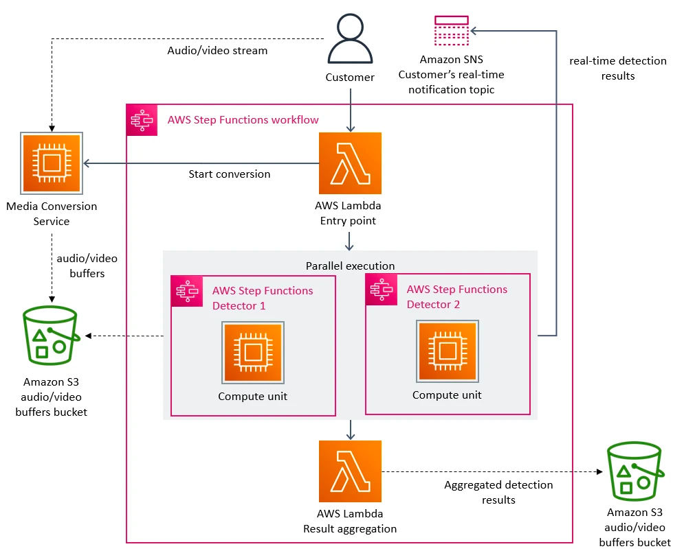
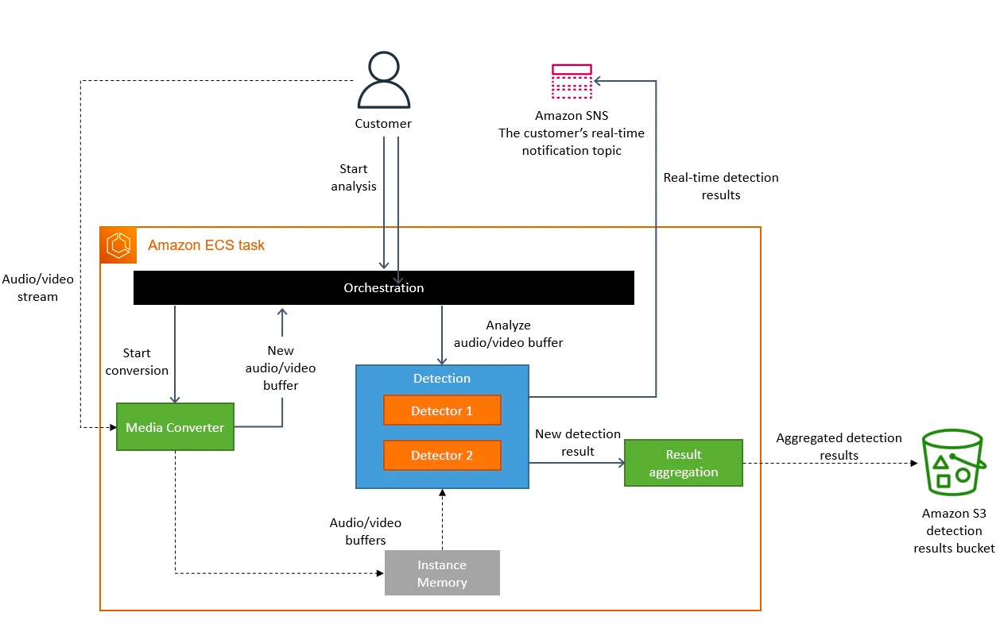
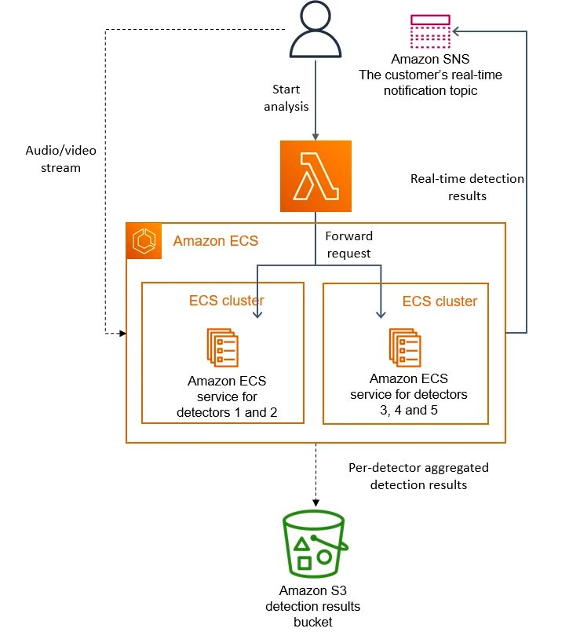

아마존의 OTT `Prime Video` 의 결함 감지 서비스를 MSA에서 모놀리스 아키텍처로 마이그레이션한 사례입니다.
보통은 모놀리스에서 MSA로 마이그레이션한 사례만 접했는데, 해당 사례는 역으로 마이그레이션 한 케이스라 흥미롭습니다.
원문은 [🔗Prime Video 테크 블로그](https://www.primevideotech.com/video-streaming/scaling-up-the-prime-video-audio-video-monitoring-service-and-reducing-costs-by-90)에서 확인하실 수 있습니다.

 

> 분산형 마이크로서비스 아키텍처에서 모놀리스 애플리케이션으로 전환하여 더 높은 규모, 내구성을 달성하고 비용을 줄일 수 있었습니다.

 

프라임 비디오(이하 프라임)에서는 수천개의 라이브 스트림을 고객에게 제공합니다.
원할한 영상 제공을 위해 프라임에서는 고객이 시청하는 모든 영상을 모니터링 하고 있습니다.
모니터링 툴 덕분에 사용자가 느끼는 품질 문제(예: 차단 손상 또는 오디오/비디오 동기화 문제)를 자동으로 식별하고 이를 해결하기 위한 프로세스를 시행할 수 있습니다.

프라임의 비디오 품질 분석 팀은 오디오/비디오 품질 검사 도구를 이미 보유하고 있었지만, 대규모 라이브 스트림을 모니터링 하기 위해 설계된 것은 아니었습니다.
서비스에 더 많은 영상을 추가하는 과정에서 대규모의 인프라를 실행할 때 많은 비용이 든다는 사실과 스트림 모니터링 시 방해되는 병목 현상 역시 발견했습니다.
그래서 우리는 비용 문제와 스케일링시 병목 현상에 초첨을 맞춰 기존 서비스의 아키텍처를 검토 했습니다.

초기의 프라임은 AWS Step Functions 으로 오케스트레이션 되는 분산 서버 형태로 구성되어 있었습니다.
비용 측면에서 가장 비싼 태스크는 오케스트레이션 워크플로우와 분산된 컴포넌트 간 데이터 전송이었습니다.
이 문제를 해결하기 위해 모든 구성 요소를 Single Process 로 옮겨 프로세스 메모리 내에서 데이터 전송을 유지하여 오케스트레이션 로직도 간소화했습니다.
모든 작업을 단일 프로세스로 컴파일한 덕분에 배포를 위해 확장 가능한 EC2 및 ECS 인스턴스를 사용할 수 있었습니다.

 

### 분산 시스템에서의 오버헤드

프라임은 세 가지 주요 컴포넌트로 이루어져 있습니다.
1. `미디어 변환기`는 입력 오디오/비디오 스트림을 프레임 또는 해독된 오디오 버퍼로 변환하여 Detector 로 전송합니다.
2. `Defect Detector` 는 프레임과 오디오 버퍼를 실시간으로 분석하여 결함(비디오 정지, 블록 손상 또는 오디도/비디오 동기화 문제 등)을 탐지하고 결함 발견 시 실시간 알림을 보냅니다.
이 내용에 대한 자세한 내용은 "[프라임 비디오가 머신 러닝을 사용하여 동영상 품질을 보장하는 방법](https://www.primevideotech.com/computer-vision/how-prime-video-uses-machine-learning-to-ensure-video-quality)" 문서를 참조하세요.
3. `오케스트레이션`은 서비스 내의 흐름을 제어하는 기능을 제공합니다.

프라임의 초기 솔루션은 서버리스 컴포넌트(AWS Step Functions 나 AWS Lambda)를 사용하는 분산 시스템으로 설계했는데, 빠르게 서비스를 구축할 수 있는 적절한 선택이었습니다.
이론적으로는 각 서비스 컴포넌트를 독립적으로 확장할 수 있었지만, 일부 컴포넌트의 사용 방법으로 인해 예상 부하의 5% 정도 규모에서 한계에 부딪혔습니다.
또한 모든 컴포넌트의의 전체 비용이 너무 높아 대규모 솔루션으로 적용하기엔 무리였습니다.

아래 다이어그램은 프라임의 서버리스 아키텍처입니다.  

**📌 Defect Detection 시스템의 초기 아키텍처**

위 아키텍처에서 주요 스케일링 병목은 AWS Step Functions 로 구현된 오케스트레이션 관리였습니다.
우리 서비스는 스트림의 매초마다 여러 상태 전환을 수행하는데 곧 계정한도(Account Limit)에 도달했습니다.
게다가 AWS Step Functions 의 상태 전이를 수행할 때 마다 요금이 부과됐습니다.

두 번째로 발견한 비용 문제는 비디오 프레임을 여러 컴포넌트에 전달하는 방식이었습니다.
연산 비용이 높은 비디오 변환 작업을 줄이기 위해 비디오를 프레임으로 분할하고 일시적으로 이미지를 S3 버킷에 업로드 하는 마이크로서비스를 구축했습니다.
이후 `Defect Detectors` 는(각각 별도의 마이크로서비스로 실행됨) 이미지를 다운받고 AWS Lambda 를 사용하여 동시에 처리합니다.
그러나 S3 버킷에 `Tier-1` 호출 수가 많아짐에 따라 비용 역시 높아졌습니다.
> Amazon S3에서는 다른 액세스 패턴 및 비용 구조를 가진 객체를 저장하는 여러 티어 (저장 클래스)가 있습니다. Tier-1은 빈번한 액세스 데이터에 최적화된 표준 저장 클래스를 나타냅니다.

 

### 마이크로 서비스에서 모놀리스 애플리케이션까지
병목 현상을 해결하기 위해, 먼저 개별 문제를 해결하여 비용을 절감하고 확장 가능성을 높일 수 있는 방법을 고려했습니다.
우리 팀은 고심끝에 대담한 결정을 내렸는데, 인프라를 재설계하기로 결정한 것 입니다.

분산 서버 환경이 우리의 케이스(Defect Detection)와 큰 이점이 없다는걸 깨달았기에 모든 구성 요소를 단일 프로세스로 통합했습니다.
이로써 데이터 전송이 메모리 내에서 처리되므로 비디오 프레임의 중간 저장소인 S3 버킷이 불필요했습니다.
또한 단일 인스턴스 내에서 컴포넌트를 제어하는 형태로 오케스트레이션을 구현했습니다.
아래의 다이어그램은 모놀리스 애플리케이션으로 마이그레이션 된 시스템 아키텍처 입니다.  

**📌 모든 컴포넌트가 단일 ECS 내에서 실행되는 시스템으로 업데이트된 아키텍처**

 

개념적으로 High-level 아키텍처는 `미디어 변환`, `Detector`, `오케스트레이션` 등 초기 설계와 동일한 컴포넌트로 유지했습니다.
덕분에 많은 코드를 재사용하여 새로운 아키텍처로 빠르게 마이그레이션 할 수 있었습니다,.

초기 설계에서는 여러 개의 Detector가 별도의 마이크로 서비스로 실행됐기 때문에 수평적 확장이 가능했습니다.
(새 Detector를 추가하려면 새로운 마이크로 서비스를 생성하여 오케스트레이션에 연결해야 했습니다)
그러나 개선된 아키텍처는 모든 Detector가 동일한 인스턴스에서 실행되어 Detector의 수가 수직적으로만 확장됩니다.
프라임 팀에서는 지속적으로 새로운 Detector를 추가하고 있으며, 이미 단일 인스턴스의 용량을 초과한 상태입니다.
이 문제를 해결하기 위해 각 복제본을 다른 하위 집합의 Detector로 매개변수화 하여 서비스를 여러 번 복제했습니다.
또한 고객 요청을 분산하기 위해 경량 오케스트레이션 레이어를 구현했습니다.

아래 다이어그램은 단일 인스턴스의 용량이 초과될 때 탐지기를 배포하는 솔루션입니다.  

**📌 새로운 Detector를 배포할 때 접근방식**

 

### 결과와 시사점
마이크로서비스와 서버리스 컴포넌트는 대규모 서비스에서 잘 동작하는 아키텍처지만, 모놀리스 서비스를 대신하여 사용할지 여부는 케이스에 따라 결정해야 합니다.
모놀리스 서비스로 전환하면서 인프라 비용이 90% 이상 절감됐고 스케일링 기능도 향상됐습니다.
현재 수천개의 스트림을 처리할 수 있으며 서비스를 더욱 확장할 수 있는 용량을 확보했습니다.
또한 EC2와 ECS로 이전함으로써 EC2 Computing 절약 요금제를 사용할 수 있어 더 높은 비용 절감을 기대할 수 있습니다.

우리가 내린 몇 가지 결정 중 분명하지 않은 점도 있었지만 명확한 개선점은 있었습니다.
예를 들어, Computing 비용이 많이 드는 미디어 변환 프로세스를 복제하여 Detector와 더 가까운 곳에 배치했습니다.
비용 측면에서 미디어 변환을 한 번만 실행하여 그 결과를 캐싱하는 방법도 괜찮은 옵션이지만,
이것이 비용측면에서 효율적인 접근이 아니라는 점을 알게 됐습니다.

이로써 프라임 비디오는 시청자 수가 가장 많은 영상 뿐 아니라, 유저들이 시청하는 모든 스트림을 모니터링 할 수 있는 시스템으로 개선되어 더 높은 품질과 나은 고객 경험을 제공할 수 있게 됐습니다.

