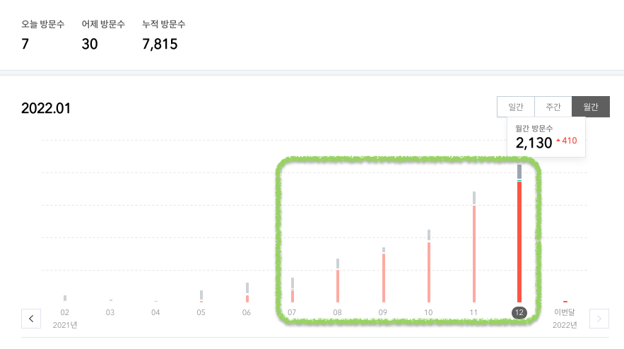
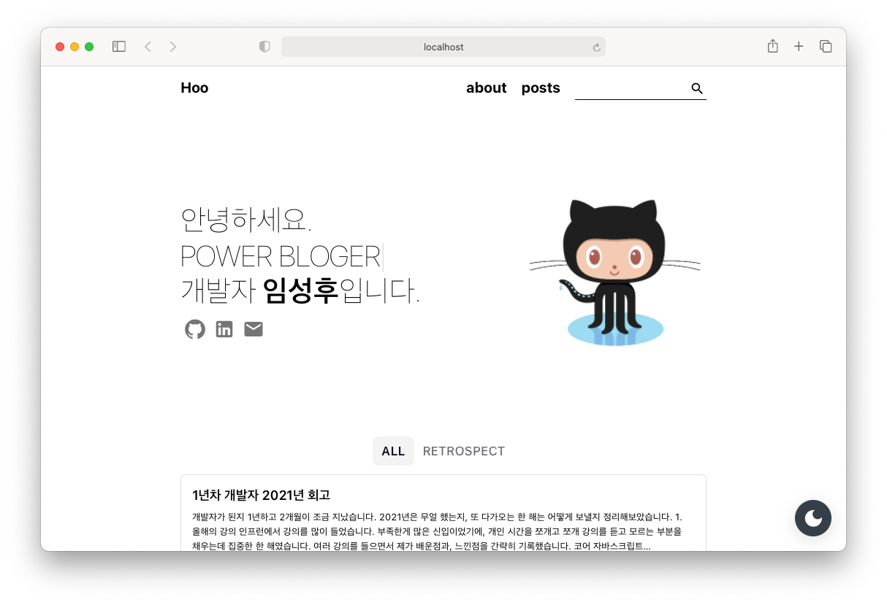

개발자가 된지 1년하고 2개월이 조금 지났습니다.
2021년은 무얼 했는지, 또 다가오는 한 해는 어떻게 보낼지 정리해보았습니다.

## 1. 올해의 강의
인프런에서 강의를 많이 들었습니다. 부족한게 많은 신입이었기에, 개인 시간을 쪼개고 쪼개 강의를 듣고 모르는 부분을 채우는데 집중한 한 해였습니다.
여러 강의를 들으면서 제가 배운점과, 느낀점을 간략히 기록했습니다.

1. [코어 자바스크립트](https://www.inflearn.com/course/%ED%95%B5%EC%8B%AC%EA%B0%9C%EB%85%90-javascript-flow/dashboard)
자바스크립트로 어느 정도 웹 서비스를 개발할 수 있는 수준이 되었지만, 그렇다고 이 언어를 잘 안다고는 말할 수 없는 어중간한 느낌을 인지했습니다.
이 때 해당 강의를 들으면서 자바스크립트를 한층 더 깊게 이해할 수 있었습니다. 이 강의를 들으면서, `하나의 언어를 깊게 공부하는 재미`를 느꼈습니다.

2. [프론트엔드 개발자를 위한, 실전 웹 성능 최적화(feat. React) - Part. 1](https://www.inflearn.com/course/%EC%9B%B9-%EC%84%B1%EB%8A%A5-%EC%B5%9C%EC%A0%81%ED%99%94-%EB%A6%AC%EC%95%A1%ED%8A%B8-1/dashboard)
사이드 프로젝트의 성능 개선을 위해 수강했습니다. 결과적으로 기존의 60점이었던 구글 라이트 점수를 97점까지 끌어올릴 수 있었습니다.
크롭 개발자 도구로 화면단의 성능을 결정할 요소를 파악하고, 적절한 개선방안을 찾을 수 있는 눈을 뜨게 해준 강의였습니다.

3. [프론트엔드 개발환경의 이해와 실습](https://www.inflearn.com/course/%ED%94%84%EB%A1%A0%ED%8A%B8%EC%97%94%EB%93%9C-%EA%B0%9C%EB%B0%9C%ED%99%98%EA%B2%BD/dashboard)
개발팀에 저 혼자 있던 시간이 길었습니다. 프론트 개발환경 세팅을 지시받았는데, 혼자 감당해야한다는 사실에 부담을 많이 느꼈습니다.
해당 강의를 들으면서 프론트엔드 개발환경의 필수 항목인 webpack 뿐만 아니라 babel, eslint 등 평소에 많이 들어봤지만 정확히 알지 못한 개념들을 익힐 수 있었습니다.

4. [모든 개발자를 위한 HTTP 웹 기본 지식](https://www.inflearn.com/course/http-%EC%9B%B9-%EB%84%A4%ED%8A%B8%EC%9B%8C%ED%81%AC/dashboard)
인프런 베스트셀러중 하나인 김영한 님의 HTTP 강좌입니다. 연초에 주말에도 회사에 나가 야금야금 강의를 들은 기억이 나네요(그 때 발이 많이 시렸는데..)
코딩 위주의 개발만 공부하다 보니, HTTP 같은 웹 기반 지식은 매우 처참한 수준이었습니다. 이 강의를 들으면서 왜 개발자가 HTTP 같은 기반지식에도 관심을 기울여야하는지, 코딩 잘하는 것만이 개발을 잘하는게 아니라는 것을 배울 수 있었습니다.
개발자로 커리어를 시작한지 3개월 차 때 해당 강의를 들었는데, 앞으로의 공부 방향을 잡을 수 있는 소중한 기회였다고 생각합니다.

5. [스프링 핵심 원리 - 기본편](https://www.inflearn.com/course/%EC%8A%A4%ED%94%84%EB%A7%81-%ED%95%B5%EC%8B%AC-%EC%9B%90%EB%A6%AC-%EA%B8%B0%EB%B3%B8%ED%8E%B8/dashboard)
사실 스프링 핵심 원리를 처음 완강했을 때는, `그래서 내가 할 수 있는게 뭐지` 라고 생각할 정도로 지식이 정리되지 않은 상태였습니다.
한번만으로는 이해할 수 없는 강의라고 판단했고, 3월부터 2회째 수강을 시작하였습니다. 이 즈음에는 적어도 무엇을 배우고 있는지 감을 잡을 수 있었습니다.
그리고 11월 부터 자바 기본서를 제대로 정독하기 시작했습니다.
그 이후로 해당 강의의 3회독을 진행했는데, 이전과는 비교도 안될 정도로 내용 흡수력이 좋아졌습니다. 역시 기본이 탄탄해야함을 몸소 느낄 수 있었고, 스프링의 객체지향적 측면에서도 많은 배움을 얻었습니다.
기세를 몰아 고급편도 얼른 수강하고 싶어졌습니다 :)

 

## 2. 올해의 책
취업준비생 시절엔 서점에 빼곡히 꽂혀있는 개발 서적을 보면서 `저걸 읽는 분들이 정말 있을까?` 생각을 많이 했습니다.
당시에는 두꺼운 개발 서적을 읽기엔 실력도, 깊이도 모자랐기에, 받아들이기 편한 인터넷 강의를 주로 찾았습니다.
올해부턴 현업에서 업무를 시작하게 됐고, 점차 아는 내용이 쌓이면서 자연스레 개발 서적에도 도전을 하게 됐습니다.

1. 자바의 신 1, 2권 (著 이상민)
2. 코어 자바스크립트 (著 정재남)
3. 스프링 입문을 위한 자바 객체 지향의 원리와 이해 (著 김종민)
-----------------------------------------
4. 달까지 가자 (著 장류진)
5. 베로니카 죽기로 결심하다 (著 파울로 코엘료)
6. 시옷의 세계 (著 김소현)
7. 방금 떠나온 세계 (著 김초엽)
8. 어린이라는 세계 (著 김소영)
9. 없던 오늘 (著 유병욱)
10. 우리는 우리를 잊지 못하고 (著 김민철)

 

... 개발도서는 상대적으로 적네요 분발해야겠습니다 ㅎ.ㅎ,,  

자바의 신 기본서를 읽으면서, 책으로 배우는 개발이 생각보다 깊이를 쌓을 수 있는 시간이었습니다.
개발자가 단지 코드만 치는 것 이상으로 업무를 해내려면 책을 읽고 끊임없이 질문을 던지고 사유하면서 더 공부해야한다고 느꼈습니다.
요즘은 `스프링 입문을 위한 자바 객체 지향의 원리와 이해` 을 2회독 중인데, 이제서야 객체지향이 무엇인지, 스프링이 어떻게 객체지향을 몸소 구현하고 있는지 알게 됐습니다.

개발 도서를 읽는 재미를 알게 됐으니 `올해`는 더 욕심내서 책을 읽으려고 합니다.
꼭 읽고 싶은 책이 3권 있는데
`1) 이펙티브 자바`
`2) 클린 코드`
`3) 리팩토링` 입니다. 욕심은 내되 깊이를 잃지 않는 독서를 하고 싶습니다.
최근에 `스프링 입문을 위한 자바 객체 지향의 원리와 이해` 1회독을 하면서 아웃풋이 없는 독서는 힘이 약하다는 생각을 했습니다.
적어도 2회독은 하면서 몰랐던 것과 새로 배운 것을 정리하는 습관을 꼭 길러야겠습니다.

 

## 3. 올해의 사이드 프로젝트
#### [슬기로운 의사생활 심리테스트](https://www.mbti-hospital-playlist.site/)
첫 (제대로 된) 사이드 프로젝트로, 퍼블리싱 작업부터 배포까지 개발의 전 프로세스를 경험할 수 있었습니다.
함께 기획하고 계획을 세워준 봉과 일러스트도 담당하여 프로젝트의 퀄리티를 높여준 뚜 까지, 두 친구 덕분에 무사히 프로젝트를 마무리할 수 있었습니다.
 
기억에 남는 점으로는, 퍼블리싱 작업이 생각보다 쉽지 않았습니다.
여기에 힘을 많이 쏟을 생각이 아니었는데 생각외로 발목을 많이 잡았고 개발 기간이 늘어나는 원인 중 하나가 되었습니다.
내년에도 혼자 사이드 프로젝트를 진행해야한다면, 기본적인 마크업 작업을 잘할 수 있도록 강의를 하나 들어보고 싶습니다.

비록 홍보가 잘 되지 않아 많은 트래픽은 경험하지 못했지만, 다음 사이드 프로젝트를 개발할 때는 어떻게 접근하고 설계해야할지 청사진을 그릴 수 있는 발팜이 됐습니다.
첫 프로젝트인 만큼 코드적인 면에서도 아쉬운 점이 많았습니다. 2022년 목표 중 하나는 해당 프로젝트를 꼭 리팩토링하여 클린한 코드로 변모시키고 싶습니다.

올해는 작년에 아쉽게 참가하지 못했던 오픈소스 컨트리뷰톤에 꼭 참여하고 싶은 목표가 생겼습니다.
더 정확히 말하면 오픈소스에 기여해보는 것인데, 컨트리뷰톤을 시작으로 차근차근 도전해보겠습니다.

+ 재밌는 사이드 프로젝트를 준비중인 분이 계시다면 백엔드 한명(저) 채가세요 :) ㅎ.ㅎ

 

## 4. 올해의 모임
#### 글또 6기
개발자 글쓰기 모임인 글또(`글`쓰는 `또`라이가 세상을 바꾼다) 6기에 참여했습니다. 비록 한번도 대면한 적은 없지만, 묘한 유대감을 느끼게 해준 모임입니다.
2주에 한번씩 꾸준히 글을 발행한다는게, 처음엔 그리 어려운 일이 아니라고 생각했는데, 시간이 지나면서
다들 개발에 진심인 분들인 만큼 배울 점도 얻어가는 점도 많았기에 꼭 다음 기수에도 참여하고 싶네요:)
 
글또 이전과 이후의 글들을 비교해보았는데, 질적으로나 양적으로도 더 성숙한 포스팅을 뽑아낼 수 있었습니다.
이전엔 간단한 버그 픽싱과 소소한 팁 위주로 쓰는 글이 대부분이었다면, 글또를 시작하면서 더 깊이 있는 내용의 글을 쓰려고 노력했습니다.
올해는 개발하면서 맞닥뜨리는 문제들을 직접 해결하고 정리하는 글로 블로그를 더 채워가고 싶습니다.

## 5. 올해의 블로그
#### 티스토리
글또를 시작하면서 본격적으로 [블로그](https://junior-datalist.tistory.com)에 글을 작성했습니다. 작고 귀여운 숫자지만 7월에 비하면 월간 방문자 수가 비약적으로 늘어난 것을 확인할 수 있었습니다.
초반에는 자바스크립트 관련 내용을 많이 정리했는데, 주로 nest.js 트러블 슈팅 관련 포스팅이 인기를 끌었습니다.

하반기 부터는 java 기본 관련 내용을 포스팅했고, 내년에도 그 방향을 쭉 이어나갈 생각입니다.
`가독성` 과 `정확성`에 신경을 많이 썼고, 댓글로 쉽게 잘 이해할 수 있었단 말을 들을 때 가장 기분이 좋았습니다.
영어 학원과 멋쟁이 사자처럼 직장인 에서 보조강사로 일한 경험이 있는데, 당시에도 쉽고 차분하게 가르쳐준다는 피드백을 받았을 때,
제가 잘할 수 있는 부분이 이것이라고 느꼈습니다. 앞으로의 포스팅에서도 이런 강점을 잘 살려 꾸준히 글을 발행하고 싶습니다.

#### 개인 블로그
티스토리 블로그는 많은 편의성을 제공하지만, 역설적이게 그에 따른 불편함도 존재합니다. 마크다운 이용이 쉽지 않다는 점과, 코드 블록을 사용하기 위해 매번 번거로운 클릭을 해야한다는 점이 불편했습니다.
그래서 올해부터는 새로운 블로그에서 글을 올릴 생각입니다. 개인 블로그인 만큼 저를 대표하는 또 하나의 홈페이지가 생긴 것 같아, 이전보다 더 양질의 글을 뽑아야 겠다는 다짐도 들었습니다.
블로그 호스팅은 github page를 이용했고 테마는 [zoomkoding](https://www.zoomkoding.com/gatsby-github-blog/) 님이 만든 gatsby 를 선택했습니다. 깔끔하고 심플한 블로그를 사용할 수 있게 해준 줌코딩님께 소소한 감사를 표합니다 :)

 

## 5. 올해의 운동
#### 크로스핏 (feat. HOLIXGROUND)
[홀릭스 그라운드](https://www.instagram.com/holixground/)라는 멋진 곳에서 크로스핏을 다시 시작했습니다.
하루중에 걱정고민 없이 운동에만 집중할 수 있는 시간을 만들어주는 곳이라 정이 많이 갑니다.
개발자가 된 뒤로 성향이 ENFP에서 INFP로 바뀌는 바람에(?) 비록 많은 분들과 친해지진 못햇지만, 2022년엔 함께 운동하는 사람들과 더 즐겁게 운동하고 싶다는 소박한 목표(?)도 생겼습니다.
다치지 않고 즐겁게 운동하고 싶습니다 :))

 

## 6. 올해의 반성
- 방향이 명확한 사람이 되고 싶습니다.
회사에서는 프론트와 백엔드 업무를 모두 맡고 있기에 양쪽에 어중간하게 발을 걸치고 있습니다.
상반기와 중반만 해도 프론트엔드를 더 깊게 공부하고 있었는데, 하반기가 되면서 백엔드에 더 시간을 많이 쏟자고 마음을 잡았습니다.
방향이 명확해지니 행동에도 변화가 생겼습니다. 자바 기본서와 스프링 책을 더 깊게 읽게 됐고, DB와 SQL 에도 시간을 더 할애했습니다.
개인 공부시간도 눈에띄게 변화가 늘어났습니다.
상반기에는 무작정 시간을 쏟기만 했다면, 하반기에는 뽀모도로로 공부시간을 체크하면서 시간에 밀도를 높이는데 집중했습니다.

- 가시적인 결과물에 집중할 필요를 느꼈습니다.
결과만큼 과정을 중시하는 삶을 살았습니다.
`열심히 해왔잖아, 지금 결과가 좋지 않더라도 나중에는 빛을 발할꺼야` 라는 마인드가 마음 한켠에 늘 자리잡고 있었습니다.
그런 마음이 항상 어중간한 결과를 가져왔다는 생각이 들었습니다.
행동은 계획보다 강하지만, 행동 그 자체로 만족하지 않고 성과를 이끌어내는 삶을 살고 싶어졌습니다.
이것저것 많은 일을 했던 2021년이었지만, 만족할만한 결과는 내지 못한 것은 분명 아쉬운 한 해였습니다.

- 좋은 개발자이기 이전에 좋은 사람이 되고 싶습니다.
 개발자가 되기 전엔, 여러 대외활동을 하면서 다양한 사람들을 만났지만 크게 누군가와 다투거나 마음이 상했던 적은 드물었습니다.
적당히 타협할 줄 알았고, 적당히 거리를 유지하면서 모두와 사이좋게 지내는 원만한 관계를 유지하며 살았습니다.
그래서 저는 협업과 커뮤니케이션에 강점이 있는 사람이라고 `착각` 하며 살았습니다.
실제로 개발자가 되어 협업을 해보니 내가 말을 이렇게 못했나 싶을 정도로 더듬을 때도 많았고, 의견 조율이 쉽지 않아 목소리가 높아졌던 부끄러운 기억도 많은 2021년이었습니다.

## 7. 마무리
항상 마무리가 쉽지 않습니다.
2022년의 저는 어떻게 살아갈지 쉽사리 목표를 정하지 못하겠습니다. 목표를 정하더라도 올해 연말이 됐을 때, 목표를 이루지 못했을까봐 두려운 마음이 드는 것도 사실입니다.
그럼에도 한가지 목표를 정해야 한다면, 올해는 꼭 목표한 기업으로 이직 하고 싶습니다. 환경의 중요성도 뼈저리게 느낀 한 해였던 만큼, 깊게 배우고 느낄 수 있는 곳에서 또 피터지게 살아가고 싶습니다.
개발자로 평생 살아갈 수 있을지 확신이 없어 두려운 것도 사실이지만, 지금 이 순간에 최선을 다하다 보면 언젠가는 원하는 모습에 닿게 되리라고 믿습니다.
