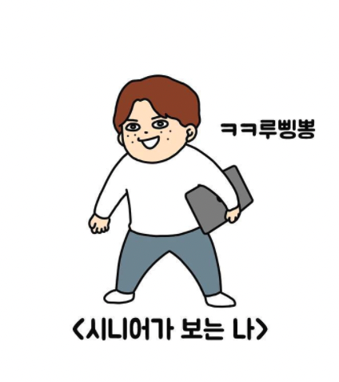

처음 글또를 시작했던 [2021년 7월의 글](https://junior-datalist.tistory.com/149)

6기, 7기를 거쳐 8기에 참여하게 됐다. 내가 애정하는 커뮤니티가 점점 커지는 모습을 보니 뿌듯하다. 기여한 건 별로 없지만 ㅎ..

### 글또 8기 다짐
- 8기 회고 글 제출
  - 6기의 다짐글을 다시 읽으니, 2년 전의 나는 어떤 주제에 관심을 가졌고, 무슨 목표가 있었는지 되돌아볼 수 있었다. 이런 류의 기록이 많이 남지 않아 아쉬웠다. 회고를 패스로 대체한 것도 살짝 후회했다.
  - 한 기수의 마무리와 소회를 글로 남겨둘 수 있는 건 큰 행운이다. 기억은 휘발되고 왜곡될 수 있지만, 기록은 그 자체로 남는다, Immutable U know.

### No Pass
- 7기 때 벌금(?)을 내진 않았지만 패스는 2회 모두 사용했다. 이번 기수는 No Pass 가 목표다. 쓸 주제는 차고 넘치는데, 뭘 써야 할지 모르겠다는 핑계를 대지 않았으면 한다. 긴장하라 미래의 나

### 영양가 있는 글 제출
- 추상적인 다짐이지만 내가 생각하는 영양가 있는 글은 '문제 해결 과정과 결과가 정리된 글 / 흔히 접할 수 없는 리뷰' 등 이 있다.
- 블로그는 평소에도 꾸준히 쓰고 있었지만, 글또에 제출할 성격의 글은 아니라고 판단했다. 그나마 최근 쓴 글 중에선 @Cacheable 메서드 내부 호출 개선하기 (feat. self invocation)이 적당한데, 여기선 문제를 어떤 방법들로 해결했는지 기술할 수 있어 만족스러웠다. 이런 식의 글을 많이 쓸 수 있길 바란다!
- 흔히 접할 수 없는 리뷰는, Nextstep의 ATDD 과정을 들으면서 생각했다. 고가의 강의인만큼 많은 사람들이 궁금해할 것으로 예상한다. 잘 수료해서 리뷰글을 남기도록 해야지.

### 커피챗 6회 이상 참여 (현재 1/6)
- '커피챗 활발히 참여'로 썼다가 수치화해 두는 게 좋을 것 같아 수정했다. 어제 슬기님 덕분에 조찬모임에 참여했다. 기대했던 만큼 유익한 시간이었다. 혼자 지내는 시간이 길다 보니 종종 내 생각에 갇히는 경우가 있는데, 여러 개발자 분들과 만나면 다양한 생각과 세계를 알 수 있어 즐겁다.

### 분야를 넓혀 활동하기
- 이것 역시 추상적인 다짐인데,,, 글또가 단순히 글쓰기 모임은 아니라고 생각했다. 글또 내에서 자연스레 여러 소모임과 채널이 생기고 있다. 글을 쓰는 것이 주 목표인 모임이지만, 그 외의 모든 일도 주체적이고 자발적으로 진행할 수 있는 커뮤니티로 성장했다고 느낀다.
- 쓰라는 글은 안쓰고 소모임/채널에서만 활발히 스레드를 달고 있다. 현재 달려또와 감사해또, 카페가또, 뮤지크스타또 등에서 활동중인데그 안에서 만난 분들과도 새로운 교류를 하고 싶다. 새로운 분야의 사람을 만날 때 나의 세계가 넓어지는 느낌을 격렬히 환영하는 편인데, 실제로 저번 기수에 만난 글또 분들 덕분에 경험하지 못할 다양한 일들을 내 삶으로 끌어 당길 수 있었다. 이번 기수에선 주체적으로 새로운 세계를 당겨오고 싶다.

 

출처: IG @waterglasstoon

