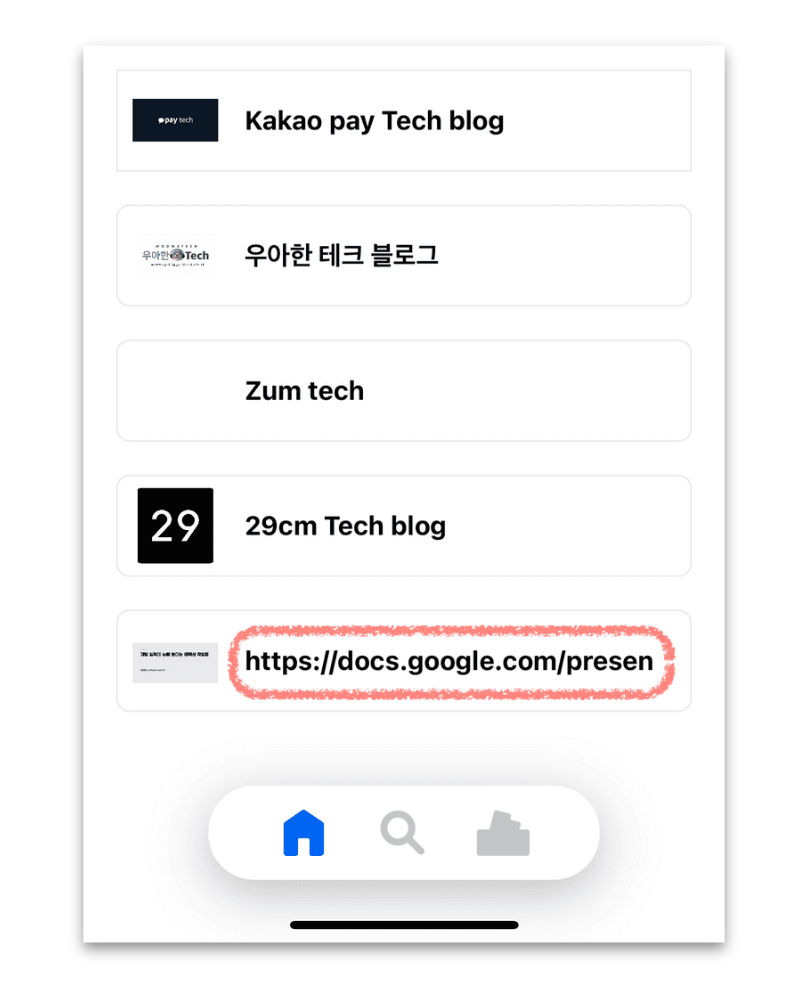

## 개요

최근에 앱을 출시했답니다.⭐️

**`Tidify`** 는 링크 아카이빙 서비스로, 링크를 복사하거나 Share Extension 을 사용하여 북마크를 자동으로 생성해주는 서비스입니다.
사용자 편의성을 위해 링크 입력 후 북마크의 이름을 지정하지 않으면, url(링크)을 북마크의 이름으로 자동 저장합니다.
하지만 편의성을 위한 이 기능이 어느날 `에러를 내버리는데`...

(아직 베타버전이라 본격적인 홍보는 하지 않았지만 [🔗앱스토어](https://apps.apple.com/kr/app/tidify/id6449292500) 에서 다운받을 수 있습니다)


<br>

## OpenAI 도입 배경

특정 링크(url)의 길이가 300자를 넘을 경우 DB table 의 `name` column 에서 Too long for column 에러가 발생합니다.
당시에는 단순히 컬럼의 최대 길이를 500자로 늘려 대처했지만, 근본적인 대처 방법은 아니라 생각했습니다.
특정 케이스만을 위해 name column 을 500자로 늘리는 건 오바라 생각했거든요.


``` bash
com.mysql.cj.jdbc.exceptions.MysqlDataTruncation:
Data truncation: Data too long for column 'name' at row 1
```

<br>

DB 에서 Table column 설정을 바꾸기 보단, 링크의 적절한 name 을 생성할 수 있는 방법을 구상했습니다.

처음엔 2가지 접근을 생각했습니다.
url 을 파싱하여 1) 도메인만 저장하거나 2) 전체 url 대신, 특정 길이까지만 slicing 하여 저장하는 방식을 생각했습니다.

1. 하지만 도메인을 파싱할 경우, 여러 url 마다 도메인 네임의 위치가 불규칙하다는 문제가 있었습니다.
2. 특정 길이까지 slicing 하는 방법은, 사용자에게 좋지 않은 UI 라는 디자이너의 피드백이 있었습니다.
   가령 아래처럼 길이가 긴 url 을 특정 길이까지 slicing 하여 저장하면 어중간한 이름이 생성되버립니다.

``` bash
Before : https://docs.google.com/presentation/d/1XnBMiHbgZmclXT4dLfI6Q7fnNnXQwfo165458o3Qzv4/mobilepresent?slide=id.p <br/>
After : https://docs.google.com/presen
```

<br>

이렇게 짤려버릴지도 모르는 일이니까요. 앱 UI 상엔 이렇게 저장되겠죠.



<br/>

색다른 접근이 필요했습니다. 북마크 이름 입력을 강제하는 방법은 사용하고 싶지 않았습니다. 그런 식으로 해결하면 우선 저부터 앱을 사용하지 않을 것 같으니까요.

url 을 대표할 수 있는 북마크 이름을 자동으로 생성하는 것이 문제의 관건인데, 이 때 떠오르는 **`그 이름`**

그렇습니다. 그분이 등장할 때 입니다.

`GPT` 를 사용한다면 url 만으로 그에 맞는 북마크 이름을 자동으로 생성할 수 있으리라 생각했습니다.

프롬프트에 `url 과 그에 맞는 이름`을 미리 예시로 주고, 새로운 url 을 입력하여 원하는 방식으로 이름이 생성되는지 테스트 했습니다.
이 과정에선 뤼튼을 사용했습니다.


생각보다 결과가 잘나와서 놀랐습니다.
위 같은 방법으로 프롬프트를 세팅할 수 있다면 충분히 url 의 이름을 자동으로 생성할 수 있을 것이라 생각했습니다.
지체없이 코드를 짜보기로 했습니다.

<br>


<br>
<br>

## 사용 기술과 선정 배경

Tidify 의 현재 서버는 `Java`, `Springboot` 으로 개발되어 있습니다.
OpenAI API 를 사용하기로 결정했을 때 떠오른 옵션은 **`2가지`** 였습니다.

1) 기존 Springboot 서버에 OpenAI API Dependency 추가.
2) 별도의 FastAPI 서버에 OpenAI를 Import.

단순히 OpenAI API 를 호출하기 위해서라면 별도의 서버 증설 없이 `1) Springboot` 를 그대로 사용했겠지만,
문자열 파싱과 특정 데이터 셋(csv)을 훈련시키기 위해선, `pandas` 를 활용할 수 있는 파이썬 환경이 더 유리하다고 생각해 `2) FastAPI` 를 선택했습니다.
비동기 호출이 지원되는 점도 FastAPI 를 선택한 이유 중 하나였습니다. (물론 스프링부트에서도 비동기 지원은 가능합니다)

현 단계에선 간단히 프롬프트를 세팅해, Url 에 맞는 북마크 이름을 추천 받기로 했습니다. (Pandas 는 다음 버전부터 적용하기로 ㅎ)

<br>

## 개발

개발 환경은 아래와 같습니다.

- `python` 3.9
- `fastapi` 0.95
- `openai` 0.27.7
- `uvicorn` 0.22.0
- `pydantic` 1.10.8
- `Pycharm`

<br>

FastAPI 를 사용하기로 했으니 우선 프로젝트를 생성합니다.
Pycharm 으로 간단히 FastAPI 프로젝트를 생성 할 수 있습니다.


<br>

### Main.py (Set up)

엔드포인트 개설을 위해 FastAPI()를 호출하고 Prompt 클래스를 작성합니다.

``` python
app = FastAPI()
openai.api_key = OPEN_AI_API_KEY

class Prompt(BaseModel):
    question: str
```

<br>

### Main.py (End point)

open.Completion.create() 함수를 작성하고 engine, prompt, max_tokens, n, temperature 인자를 받습니다.

- `engine` : 사용할 GPT 모델의 이름입니다. 제가 사용한 'text-davinci-002' 는 OpenAi 개발한 GPT 모델 중 하나입니다.
- `prompt` : 말 그대로 프롬프트 입니다. GPT engine 에 질문할 내용에 해당됩니다.
- `max_tokens` : 결과에 사용될 최대 토큰 수 입니다. 토큰은 단어나 구두점 부호로 생각할 수 있습니다.
- `n` : 프롬프트에 생성될 응답의 수 입니다. 1 로 지정한 경우, 한 가지의 텍스트 응답이 생성됩니다.
- `temperature` : 샘플링 방법으로 무작위성을 제어합니다. temperature 값이 높을 수록 모델은 다양하고 창의성 높은 문장을 생성하며, 값이 낮을 경우 일관적이고 예상 가능한 문장을 생성합니다.

``` python
@app.post("/ask_openai")
async def ask_openai(prompt: Prompt) -> str:

    response = openai.Completion.create(
        engine="text-davinci-002",
        prompt=preset_prompt,
        max_tokens=100,
        n=1,
        temperature=0.5,
    )

    semi_answer: str = response.choices[0].text.strip()
    return semi_answer.split('\n')[0]
```

<br>

그리고 prompt 에 사용될 preset_prompt를 작성합니다. 프롬프트를 어떻게 작성하냐에 따라 얻을 수 있는 결과가 다릅니다.
버전별로 프롬프트를 작성하며 어떤 응답을 얻는지 비교해보겠습니다.

<hr>

## Version.1

### prompt

``` python
preset_prompt = f"""
generate simple Korean name of this input URL: {prompt.question} \n
"""
```

### 결과

전혀 깔끔하지 않은 Answer 이 돌아왔습니다.
제가 원한 건 최소 `OOO 테크 블로그` 정도였는데, OpenAI 는 `웹사이트: https://techblog.woowahan.com/12044` 라고 답했습니다.
아직 훈련이 필요한 친구니 프롬프트를 좀 더 상세히 작성하겠습니다.

``` bash
Input URL : https://techblog.woowahan.com/12044
OpenAI Answer : 웹사이트: https://techblog.woowahan.com/12044
```

<hr>

## Version.2

Version.1 보다 상세히 프롬프트를 작성했습니다.

- 우선 어떤 방식으로 url 의 name 을 생성하면 좋은지 예시를 들어줬습니다.
  - `input URL` 을 제시하고, 해당 url 의 `name` 을 직접 입력했습니다.
  - 그리하여 random URL 이 입력되더라도 `제가 원하는 형식`의 name 을 얻을 수 있도록 했습니다.
- 두번째론 생성된 name 이 `single line` 이어야 한다고 재차 강조했습니다. Tidify 서비스에 사용될 북마크 name 은 대게 한줄로 저장되기 때문에 이런 제약 조건을 줬습니다.

### prompt

``` python
preset_prompt = f"""
make a simple Korean name of the url base on examples.
It's important to generate a result in Korean words as a single line,
not multiple line sentences.

the result will be used as simple bookmark,
so it's important to generate a result as simple korean words.

- example 1:
input URL: https://google.com
generated name: 구글

- example 2:
input URL: https://medium.com/29cm/backend/home
generated name: 29CM 기술 블로그

- example 3:
input URL: https://ios-development.tistory.com/945
generated name: iOS 개발 블로그

- example 4:
input URL: https://29cm.career.greetinghr.com/o/77203
generated name: 29cm 채용 공고 페이지

- example 5:
input URL: https://www.linkedin.com/posts/catalin-patrascu_swift-concatenation-
generated name: LinkedIn Swift Concatenation 포스트

- example 6:
input URL: https://wrtn.ai/
generated name: 뤼튼

- example 7:
input URL: https://jh-bk.tistory.com/23
generated name: jh-bk 의 티스토리

- example 8:
input URL: https://docs.google.com/presentation/d/1XnBMiHbgZmclXT4dLfI6Q7fnNnXQwfo165458o3Qzv4/mobilepresent?slide=id.p
generated name: Google Presentation 슬라이드

Generate simple Korean name of this input URL: {prompt.question} \n
"""
```

<br>

### 결과

Version.1과 동일한 url 로 테스트 해보겠습니다.


프롬프트만 바꿨을 뿐인데 성능(?)이 비약적으로 좋아진 걸 확인할 수 있습니다.

``` bash
Input URL : https://techblog.woowahan.com/12044
OpenAI Answer : 우아한 기술 블로그
```

<br>

<hr>

[또 다른 url](https://docs.google.com/forms/d/e/1FAIpQLSciq7dwuIV7t0g9cITjCnf1vq1xRjj6dTfAT7hDLiwcfUn17w/viewform) 로 테스트
해보겠습니다.

### Version.1


``` bash
Input URL : https://docs.google.com/forms/d/e/1FAIpQLSciq7dwuIV7t0g9cITjCnf1vq1xRjj6dTfAT7hDLiwcfUn17w/viewform
OpenAI Answer : 이름:
```

### Version.2


``` bash
Input URL : https://docs.google.com/forms/d/e/1FAIpQLSciq7dwuIV7t0g9cITjCnf1vq1xRjj6dTfAT7hDLiwcfUn17w/viewform
OpenAI Answer : Goolge Form 설문조사
```

<br>

난해한 url 이더라도 Prompt 를 어떻게 세팅하냐에 따라 응답 결과가 천차만별인 것을 확인할 수 있습니다.

<br>


### Main.py (전체 코드)

전체 코드도 공유하겠습니다.
코드를 깔끔히 보기 위해 Version2 에서 활용한 prompt 는 별도의 파일(secret.py)에 분리하여 import 했습니다.

``` python
import openai
from fastapi import FastAPI
from pydantic import BaseModel
from secret import OPEN_AI_API_KEY, PRE_PROMPT

app = FastAPI()
openai.api_key = OPEN_AI_API_KEY


class Prompt(BaseModel):
    question: str


@app.post("/ask_openai")
async def ask_openai(prompt: Prompt) -> str:
    preset_prompt = f"""
    {PRE_PROMPT}
    generate simple Korean name of this input URL: {prompt.question} \n
    """

    response = openai.Completion.create(
        engine="text-davinci-002",
        prompt=preset_prompt,
        max_tokens=100,
        n=1,
        temperature=0.5
    )

    semi_answer: str = response.choices[0].text.strip()
    return semi_answer.split('\n')[0]


if __name__ == "__main__":
    import uvicorn

    uvicorn.run(app, host="0.0.0.0", port=8000)

```

<br>
<br>
<br>

## 마무리

As-Is 와 To-Be 를 비교하며 마무리 짓겠습니다.

## As-Is

기존엔 `북마크 이름`을 지정하지 않으면 `input url` 과 `동일한 값`으로 서버에서 세팅해줍니다.
앞서 언급했듯 url 이 너무 길 경우를 대비해 name column 도 url column 과 `동일한 길이`로 세팅해줘야 합니다.


## To-Be

OpenAI 를 활용해 이름을 세팅하는 경우입니다.

url 입력 후 북마크 이름을 따로 지정하지 않을 경우, OpenAI 에서 응답받은 `추천 이름` 을 앱에 리턴합니다.
프롬프트에서 결과를 single line 으로 지정하여 name 이 길어지는 문제도 해결할 수 있습니다.
추가적으로 `ask_openai()` 메서드 return 부분에서 **`split('\n')`** 후처리도 했기 때문에 `Data too long for column 'name' at row 1` 같은 문제는 미연에 방지할 수 있게 됐습니다.


<br>
<br>
<br>

이렇게 제가 운영중인 서비스에 `OpenAI API` 를 적용해보았습니다.
사용자 편의성을 위해 적용한 기능이 되려 장애를 일으킨 케이스였지만, 이를 AI 기술을 활용해 해결한 경험이었습니다.

 **`Tidify Ver.2`** 부턴 URL 을 기반으로 적합한 북마크 이름을 지정할 수 있습니다.

그럼 전 Version.2 준비하러 20000


<br>

<br>
<br>

